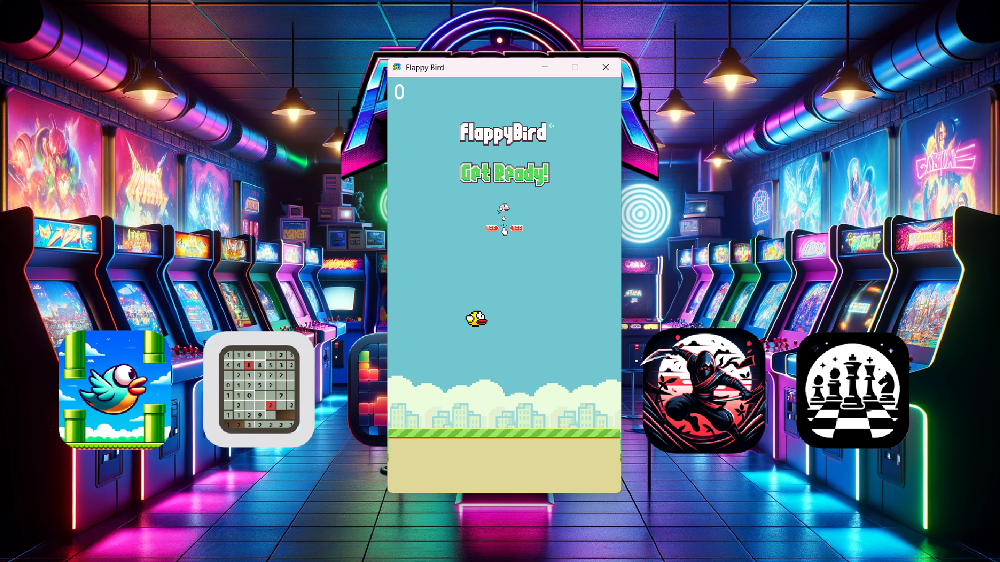
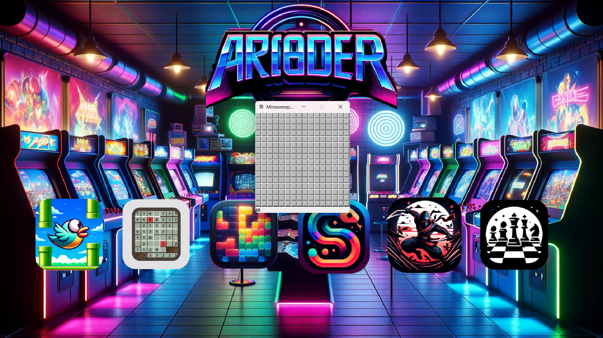
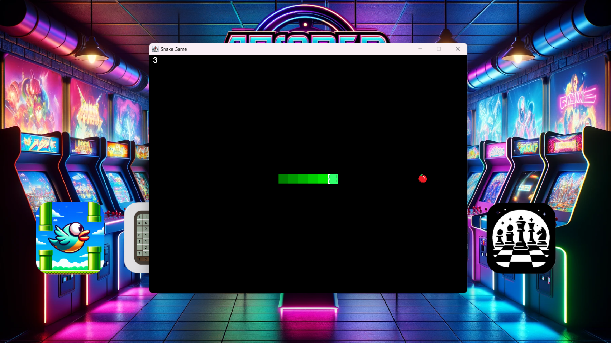
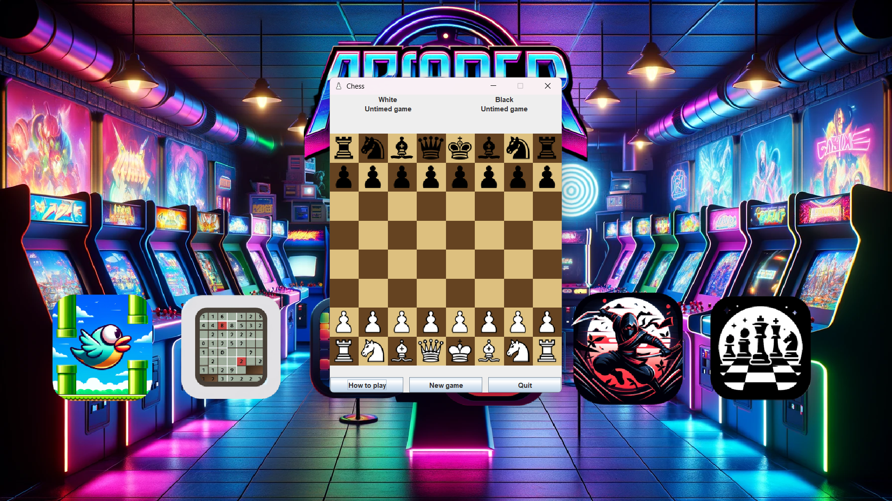

# 🎮 Arcade Game Hub (Java Swing)

An arcade pack built in **Java (Swing/AWT)**. Launch a central Arcade window or run the games directly:

- **Flappy Bird**
- **Snake**
- **Tetris**
- **Ninja Fight (2‑player)**
- **Chess (basic)**
- **Minesweeper**
- High‑score screen

> Built as a student project. Clean code, simple structure, and easy to run in IntelliJ or Eclipse.

## 🎮 Game Showcase

<p align="center">
  <br><br>

  
  
  
  
  
  
</p>

---

## 🗂️ Project Structure
```
ArcadeGame/
├─ src/
│  ├─ ArcadeFrame.java          # Main arcade window (menu)
│  ├─ FlappyLauncher.java       # Runs Flappy Bird
│  ├─ SnakeLauncher.java        # Runs Snake
│  ├─ TetrisLauncher.java       # Runs Tetris
│  ├─ FighterMain.java          # Runs Ninja Fight
│  ├─ ChessGame.java            # Runs Chess
│  ├─ games/                    # Sprites, sounds (png, wav)
│  └─ HighScoreImages/          # Images for the high‑score view
├─ .project, .classpath         # Eclipse metadata
└─ README.md
```

---

## ✅ Requirements
- **JDK 17** (or 11+ should work)
- Any IDE (IntelliJ IDEA or Eclipse)

---

## ▶️ Run (the easy way – IDE)
### IntelliJ IDEA
1. **Open** the project folder (`ArcadeGame`).
2. Mark `src` as **Sources Root** (right‑click → *Mark Directory as* → *Sources Root*).
3. Open **`ArcadeFrame.java`** and click **Run ▶** to launch the menu.
   - Or run a game directly: `FlappyLauncher`, `SnakeLauncher`, `TetrisLauncher`, `FighterMain`, `ChessGame`.

### Eclipse
1. **File → Import → Existing Projects into Workspace**.
2. Select the `ArcadeGame` folder (Eclipse will read `.project/.classpath`).
3. Right‑click **`ArcadeFrame.java`** → *Run As → Java Application*.

> ⚠️ If images/sounds don’t load, make sure you **run from the project root** so relative paths like `src/games/...` resolve.

---

## ▶️ Run from Terminal
From the **ArcadeGame** folder:

```bash
# Compile all sources into a build/ folder
javac -d build $(find src -name "*.java")

# Run the Arcade menu
java -cp build ArcadeFrame

# Or run specific games
java -cp build FlappyLauncher
java -cp build SnakeLauncher
java -cp build TetrisLauncher
java -cp build FighterMain
java -cp build ChessGame
```

> Windows (PowerShell) compile command:
> ```powershell
> javac -d build (Get-ChildItem -Recurse -Filter *.java -Path src | ForEach-Object { $_.FullName })
> ```

---

## 🎯 Features
- Smooth keyboard controls (Swing key bindings)
- Sprite animations and basic collision
- Score + game over / restart
- Simple sounds (WAV) where supported
- Separate launchers for each game

---

## 📸 Screens
Add screenshots in a `screens/` folder and reference them here:
```md


```

---

## 🛠️ Notes
- This repo includes **Eclipse** files (`.project`, `.classpath`). For Git, you should ignore IDE build folders.
- All assets are in `src/games/` and `src/HighScoreImages/`.

---

## 📦 Suggested .gitignore
```
# Java / IDE
/bin/
/build/
/out/
/target/
*.iml
.idea/
.classpath
.project
.settings/
```

---

## 👤 Author
**Hassan Sajid** — Undergraduate CS student.  
I built this to learn Java graphics and event handling.

---

## 📄 License
MIT – feel free to use/modify for learning.
